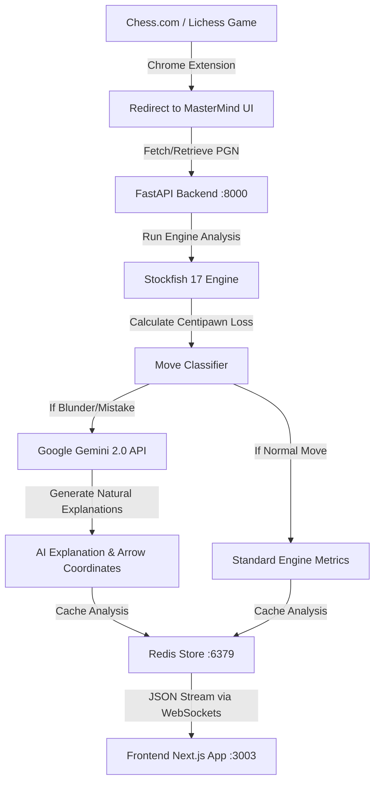

<div align="center">
  
  <h1>🧠 MasterMind - Advanced Chess Evaluation Platform</h1>
  <p><i>Professional-grade chess analysis powered by Stockfish 17 and Google Gemini 2.0 AI.</i></p>

  [](https://opensource.org/licenses/MIT)
</div>

---

## 🌟 Overview

**MasterMind** is a premium, high-performance web application designed to help chess players analyze their games, discover tactical blunders, and learn from their mistakes using natural-language AI coaching.

Rather than just displaying raw engine evaluation lines (e.g., `+2.5` or `Nf3+`), MasterMind utilizes **Google Gemini 2.0** to explain *why* a move is a mistake or blunder in plain English, while simultaneously drawing visual, colored arrows directly on the board to illustrate the AI's tactical suggestions.

It features a stunning, dark-mode focused UI that rivals top-tier platforms like Chess.com and Lichess, complete with real-time evaluation bars, accuracy gauges, interactive move lists, and branching "what-if" analysis boards.

---

## 🏗️ Architecture & Data Flow

Below is the end-to-end data flow when a game is analyzed:



---

## 🚀 Key Features

*   **Real-time WebSocket Engine Analysis:** Uses `Stockfish 17` on the backend via WebSockets to stream evaluation data, centipawn scores, and top 3 best engine variations (`Multi-PV`) live to the frontend.
*   **AI Natural Language Insights:** Integrates `Gemini 2.0 Flash` to analyze the board state before and after a blunder. It generates structured JSON responses containing a human-readable explanation and visual SVG arrow coordinates.
*   **Chrome Extension Integration:** Includes a custom browser extension that detects when a game ends on **Chess.com** or **Lichess** and automatically teleports the game to the MasterMind laboratory for instant analysis.
*   **Non-Destructive Branching:** Play out hypothetical variations ("What if I moved here instead?") directly on the analysis board. The platform intelligently saves the mainline game state, allowing you to instantly "Restore Mainline" via a sticky button.
*   **Professional UI Metrics:**
    *   **Accuracy Dashboard:** Calculates and displays Lichess-style accuracy percentages (e.g., `94.2%`) for both White and Black.
    *   **Game Trajectory Chart:** An interactive `Recharts` graph plotting the evaluation score over the course of the entire game.
    *   **Classification Badges:** Chess.com-style visual icons (`!!`, `★`, `?`, `??`) embedded directly in the move list.
*   **Redis Caching Engine:** Heavily caches analyzed positions and PGNs in Redis to prevent redundant engine calculations and API rate limits, ensuring lightning-fast load times for previously analyzed games.

---

## 🛠️ Technology Stack

**Frontend:**
*   **Next.js 15 (App Router)** - React framework for UI.
*   **Zustand** - High-performance, lightweight global state management (handles branching logic).
*   **React Chessboard** - Renders the SVG chess board and custom AI arrows.
*   **TailwindCSS** - Premium glassmorphism and animated styling.
*   **Recharts** - Dynamic SVG-based graphing library.

**Backend:**
*   **FastAPI** - Async Python framework for WebSockets and REST APIs.
*   **Python-Chess** - Core chess logic, move validation, and PGN parsing.
*   **Stockfish 17** - World's strongest open-source chess engine.
*   **Google Generative AI (Gemini)** - LLM for tactical explanations.
*   **Redis** - In-memory data store for ultra-fast caching.
*   **Docker / Docker Compose** - Containerization for isolated Stockfish and Redis environments.

---

## 💻 Setup & Installation

### 1. Prerequisites
*   **Node.js 18+** (For running the Next.js Frontend)
*   **Python 3.10+** (For running the Backend locally)
*   A **Gemini API Key** from Google AI Studio.
*   *(Optional)* **Docker & Docker Compose**

---

### 2. Environment Variables

#### Root Directory Environment File
Create a `.env` file in the root directory:
```env
GEMINI_API_KEY="your_google_gemini_api_key_here"
```

#### Backend Directory Environment File
Create a `.env` file in the `backend/` directory:
```env
STOCKFISH_PATH="d:\Chess-Game-Eval\backend\stockfish_dir\stockfish\stockfish-windows-x86-64-avx2.exe"
```
*(Adjust the `STOCKFISH_PATH` to point to your local Stockfish executable if not using Docker.)*

---

### 3. Running the Project

You can run the application using either **Docker Compose** or **Natively/Locally**.

#### Option A: Docker Compose Setup (Recommended for Production/Isolation)
If you have Docker Desktop running:
1.  Run docker-compose to build and spin up the backend and Redis:
    ```bash
    docker-compose up --build -d
    ```
2.  Start the Next.js frontend:
    ```bash
    cd frontend
    npm install
    npm run dev
    ```
    *   **Frontend:** `http://localhost:3003`
    *   **Backend:** `http://localhost:8000`

---

#### Option B: Local/Native Setup (Recommended for Development)
If you want to run the python server directly on your host machine:
1.  **Install Python requirements:**
    ```bash
    cd backend
    pip install -r requirements.txt
    ```
2.  **Start the Backend server:**
    ```bash
    python main.py
    ```
    *The server automatically falls back to run without Redis if a local Redis instance is not detected, processing analysis directly through Python & Stockfish.*
3.  **Start the Next.js frontend:**
    ```bash
    cd ../frontend
    npm install
    npm run dev
    ```
    *The Next.js frontend will run on `http://localhost:3003`.*

---

## 🧩 Chrome Extension (MasterMind Analyst)

The project includes a companion Chrome Extension located in the `/extension` directory.

### What it does:
*   Constantly monitors your active tab.
*   The moment it detects a game finishing on Chess.com or Lichess (e.g., detecting the Game Over modal), it shows a pulsing "Analyze in MasterMind" overlay.
*   Grabs the PGN, redirects to `http://localhost:3003`, and automatically triggers the analysis.

### CSP Compliance Architecture:
Chess.com enforces a strict **Content Security Policy (CSP)** that blocks dynamically injected inline scripts. 
To bypass this securely and without violating security headers, the extension is split into two components:
1.  **`interceptor.js`**: Registered in `manifest.json` as a content script running in the main world context (`world: "MAIN"`) at `document_start`. This hook safely overrides `navigator.clipboard.writeText` before any page scripts load, capturing the PGN copied by Chess.com and posting it to the extension.
2.  **`content.js`**: Runs in the isolated context (`world: "ISOLATED"`) at `document_end` to manage button states, modal listeners, and redirections without polluting the page's global scope.

### How to install:
1.  Open Google Chrome and navigate to `chrome://extensions`.
2.  Toggle **Developer mode** (top right corner).
3.  Click **Load unpacked** (top left).
4.  Select the `Chess-Game-Eval/extension` folder.

---

## 🔍 Troubleshooting Guide

#### 1. `[Errno 10048] error while attempting to bind on address`
*   **Cause:** This error occurs if another process (such as a previous Docker compose run) is already using port `8000`.
*   **Solution:** Stop any active Docker containers by running:
    ```bash
    docker-compose down
    ```
    Alternatively, identify and kill the process using port 8000:
    ```powershell
    # Windows PowerShell
    Stop-Process -Id (Get-NetTCPConnection -LocalPort 8000).OwningProcess -Force
    ```

#### 2. `Gemini Error: 429 You exceeded your current quota`
*   **Cause:** The free tier of the Gemini API has strict rate limits (e.g., 15 requests per minute, 1,500 requests per day).
*   **Solution:** When this occurs, the backend will log a 429 warning but will proceed with standard Stockfish metrics (accuracy and classifications) without crashing. Wait a few moments before trying another game, or upgrade your Gemini API key tier in Google AI Studio.

#### 3. Stockfish Engine Fails to Start
*   **Cause:** The executable path in `backend/.env` is incorrect or lacks permissions.
*   **Solution:** Double check `STOCKFISH_PATH` in `backend/.env` and ensure it uses absolute paths. On macOS/Linux, ensure the file is executable:
    ```bash
    chmod +x /path/to/stockfish
    ```

---

## 📜 License

This project is licensed under the **MIT License**. See the `LICENSE` file for details. You are free to use, modify, and distribute this software for personal or commercial projects.
