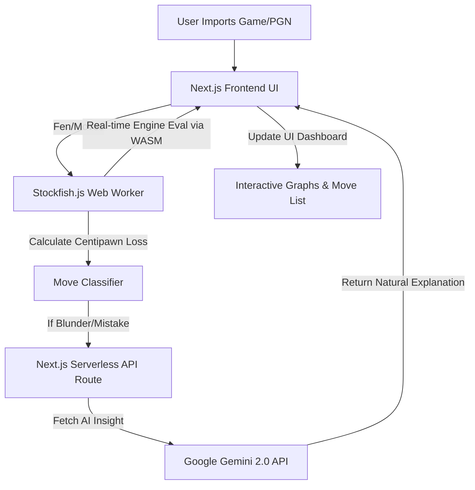

<div align="center">
  
  <h1>🧠 ChessEval - Advanced Chess Evaluation Platform</h1>
  <p><i>Professional-grade chess analysis powered by Stockfish 17 (WASM) and Google Gemini 2.0 AI.</i></p>

  [](https://opensource.org/licenses/MIT)
  [](https://nextjs.org/)
  [](https://tailwindcss.com/)
</div>

---

## 🌟 Overview

**ChessEval** is a premium, high-performance web application designed to help chess players analyze their games, discover tactical blunders, and learn from their mistakes using natural-language AI coaching.

Rather than just displaying raw engine evaluation lines (e.g., `+2.5` or `Nf3+`), ChessEval utilizes **Google Gemini 2.0** to explain *why* a move is a mistake or blunder in plain English. The entire application is architected to be extremely fast and runs natively in your browser using **WebAssembly (WASM)** and **Next.js App Router**, completely eliminating the need for a complex backend server.

It features a stunning, dark-mode focused UI that rivals top-tier platforms like Chess.com and Lichess, complete with real-time evaluation bars, accuracy gauges, interactive move lists, and newly-added support for **non-destructive branching** and **dynamic evaluation graphs**.

---

## 🏗️ Architecture & Data Flow

The architecture is built entirely on modern, serverless web technologies.



---

## 🚀 Key Features

### 💻 Client-Side Stockfish Analysis
Uses a compiled WebAssembly version of `Stockfish 17` (`stockfish.js`) running natively in your browser via Web Workers. This ensures zero server latency and keeps your UI completely responsive while calculating millions of nodes per second locally.

### 🤖 AI Natural Language Insights
Integrates `Gemini 2.0 Flash` (via Next.js API routes) to analyze the board state before and after a blunder. It generates human-readable explanations to help you understand complex tactical concepts, turning the engine into a personal coach.

### 📈 Advanced Dynamic Evaluation Graph
The evaluation graph utilizes a highly dynamic **non-linear Arctan scale** (`y = atan(cp/200)`). Unlike traditional linear graphs that flatline during subtle positional maneuvering, ChessEval's graph exaggerates small advantage shifts (e.g., moving from +0.2 to +1.0). This provides visually prominent peaks and valleys, allowing players to instantly identify critical momentum shifts in the game.

### 🔀 Non-Destructive Move Diversions
Play out hypothetical variations ("What if I moved here instead?") directly on the analysis board. 
- Clicking **"Best was: [Move]"** seamlessly injects the engine's recommendation as an indented sub-variation (diversion) directly underneath your played move in the move list.
- **Mainline Preservation:** Unlike standard analysis boards that truncate your game when you explore a new line, ChessEval preserves your original game history, allowing you to freely explore "what-ifs" without losing your place.
- You can instantly jump back to your original game via the sticky "Restore Mainline" button.

### 📊 Professional UI Metrics
*   **Accuracy Dashboard:** Calculates and displays Lichess-style accuracy percentages (e.g., `94.2%`) for both White and Black based on precise centipawn loss calculations.
*   **Classification Badges:** Chess.com-style visual icons (`!!` Brilliant, `★` Best, `?` Mistake, `??` Blunder) embedded directly in the interactive move list.
*   **Critical Moments Navigation:** A streamlined horizontal jump bar that allows you to instantly skip to the most volatile blunders or brilliant moves in the match.

### ♟️ Game History & Import Integration
Seamlessly fetch and analyze your chess games directly from **Chess.com** and **Lichess**. The dedicated History page allows you to view past matches and includes a dynamic modal to import games from any specific month on-demand. Additional tools include an Elo Calculator and Daily Puzzles.

---

## 🛠️ Technology Stack

*   **Next.js 15 (App Router)** - React framework for UI and Serverless API routes.
*   **Stockfish.js (WASM)** - World-class open-source chess engine running in the browser.
*   **Google Generative AI (Gemini)** - LLM integration for tactical explanations.
*   **Zustand** - High-performance, lightweight global state management for handling complex chess branching logic and variations.
*   **React Chessboard** - Renders the interactive SVG chess board.
*   **TailwindCSS** - Premium glassmorphism and animated modern styling.
*   **Recharts / Custom SVG** - Dynamic data visualization for the evaluation sparkline.
*   **chess.js** - Core chess logic, move validation, fen generation, and PGN parsing.

---

## 💻 Setup & Installation

### 1. Prerequisites
*   **Node.js 18+**
*   A **Gemini API Key** from [Google AI Studio](https://aistudio.google.com/).

### 2. Environment Variables
Create a `.env.local` file in the root `frontend/` directory:
```env
GEMINI_API_KEY="your_google_gemini_api_key_here"
```

### 3. Running the Project
The entire application runs as a single Next.js project. You do not need to install Python, Docker, or Redis!

```bash
cd frontend
npm install
npm run dev
```

The application will run locally on `http://localhost:3003`. (Port configured via package.json scripts).

---

## 📘 Usage Guide

1. **Import a Game:** Go to the History tab and fetch your games from Chess.com/Lichess, or paste a PGN directly into the Analysis tab.
2. **Review Blunders:** Look for red or orange icons (`?`, `??`) in the Move List. Hover over these moves to see a popover with CP loss and engine evaluations.
3. **Explore Variations:** Inside the popover for a mistake, click the yellow "Best was: X" button. This will inject the best move directly below your move as a non-destructive variation line.
4. **Ask the Coach:** Navigate to the Coach tab while previewing a blunder to get a plain-English explanation generated by Gemini 2.0.

---

## 📜 License

This project is licensed under the **MIT License**. See the `LICENSE` file for details. You are free to use, modify, and distribute this software for personal or commercial projects.
