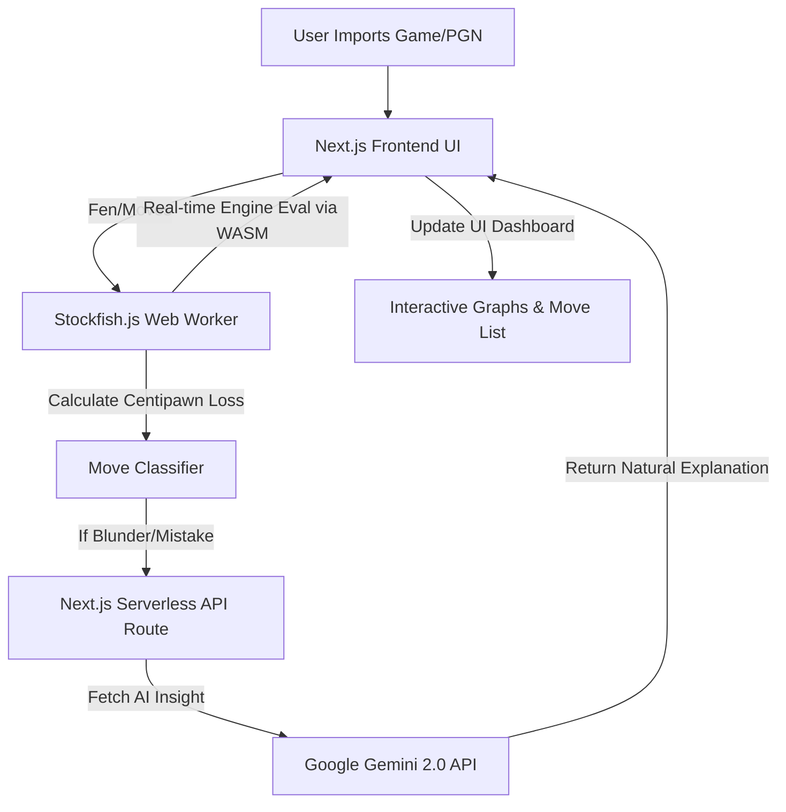

<div align="center">
  
  <h1>🧠 MasterMind - Advanced Chess Evaluation Platform</h1>
  <p><i>Professional-grade chess analysis powered by Stockfish 17 (WASM) and Google Gemini 2.0 AI.</i></p>

  [](https://opensource.org/licenses/MIT)
</div>

---

## 🌟 Overview

**MasterMind** is a premium, high-performance web application designed to help chess players analyze their games, discover tactical blunders, and learn from their mistakes using natural-language AI coaching.

Rather than just displaying raw engine evaluation lines (e.g., `+2.5` or `Nf3+`), MasterMind utilizes **Google Gemini 2.0** to explain *why* a move is a mistake or blunder in plain English. The entire application is architected to be extremely fast and runs natively in your browser using **WebAssembly (WASM)** and **Next.js App Router**, completely eliminating the need for a complex backend server.

It features a stunning, dark-mode focused UI that rivals top-tier platforms like Chess.com and Lichess, complete with real-time evaluation bars, accuracy gauges, interactive move lists, and branching "what-if" analysis boards.

---

## 🏗️ Architecture & Data Flow

The architecture is built entirely on modern, serverless web technologies.



---

## 🚀 Key Features

*   **Client-Side Stockfish Analysis:** Uses a compiled WebAssembly version of `Stockfish 17` (`stockfish.js`) running natively in your browser via Web Workers. This ensures zero server latency and keeps your UI completely responsive while calculating millions of nodes per second locally.
*   **AI Natural Language Insights:** Integrates `Gemini 2.0 Flash` (via Next.js API routes) to analyze the board state before and after a blunder. It generates human-readable explanations to help you understand complex tactical concepts.
*   **Game History & Import Integration:** Seamlessly fetch and analyze your chess games directly from **Chess.com** and **Lichess**. The dedicated History page allows you to view past matches and includes a dynamic modal to import games from any specific month on-demand.
*   **Non-Destructive Branching:** Play out hypothetical variations ("What if I moved here instead?") directly on the analysis board. The platform intelligently tracks the mainline game state, allowing you to instantly "Restore Mainline" via a sticky button.
*   **Professional UI Metrics:**
    *   **Accuracy Dashboard:** Calculates and displays Lichess-style accuracy percentages (e.g., `94.2%`) for both White and Black.
    *   **Game Trajectory Chart:** An interactive `Recharts` graph plotting the evaluation score over the course of the entire game.
    *   **Classification Badges:** Chess.com-style visual icons (`!!`, `★`, `?`, `??`) embedded directly in the interactive move list.
*   **Additional Chess Tools:** Comes built-in with an Elo Calculator and a Daily Puzzles section, providing a complete chess training ecosystem.

---

## 🛠️ Technology Stack

*   **Next.js 15 (App Router)** - React framework for UI and Serverless API routes.
*   **Stockfish.js (WASM)** - World-class open-source chess engine running in the browser.
*   **Google Generative AI (Gemini)** - LLM integration for tactical explanations.
*   **Zustand** - High-performance, lightweight global state management for handling complex chess branching logic.
*   **React Chessboard** - Renders the interactive SVG chess board.
*   **TailwindCSS** - Premium glassmorphism and animated modern styling.
*   **Recharts** - Dynamic SVG-based data visualization library.
*   **chess.js** - Core chess logic, move validation, and PGN parsing.

---

## 💻 Setup & Installation

### 1. Prerequisites
*   **Node.js 18+**
*   A **Gemini API Key** from Google AI Studio.

### 2. Environment Variables
Create a `.env.local` file in the `frontend/` directory:
```env
GEMINI_API_KEY="your_google_gemini_api_key_here"
```

### 3. Running the Project
The entire application runs as a single Next.js project. You do not need to install Python, Docker, or Redis!

```bash
cd frontend
npm install
npm run dev
```

The Next.js application will run on `http://localhost:3003`. 

---

## 📜 License

This project is licensed under the **MIT License**. See the `LICENSE` file for details. You are free to use, modify, and distribute this software for personal or commercial projects.
